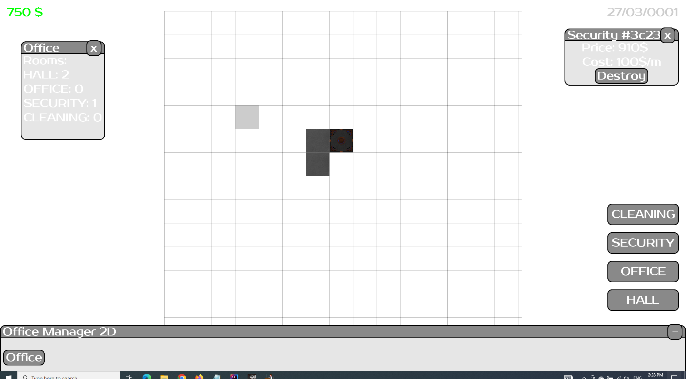

## Office Manager 2D version 1.0
Hello, there!

This is initial version of my project OM2D. Currently supported features you can view down
### Features:

1) Build 4 types of rooms in office.
2) View your office information
3) Monitor prices for your rooms
4) Place few items (currently 2, but one with texture)
5) Turn on and turn off the grid
6) Time passes while playing: days, months and years 
7) There are textures for environment objects and for 2 rooms
8) Updated UI

### Project stack:

1) Java 11
2) LibGDX
3) SQLite

But this is not the end! I'm actively developing my project to make it very funny!

Here you can view the screenshot from current version:

### For contribution
Please create new branch with issue name and create pull request to master when finished

### Textures, fonts and skins owners:
1) UI skin - Orange by Raymond "Raeleus" Buckley
2) Grass - MiniWorldSprites by Shade and octoshrimpy
3) Font - Upheaval by Brian Kent
4) Road, car, rooms, other - mine