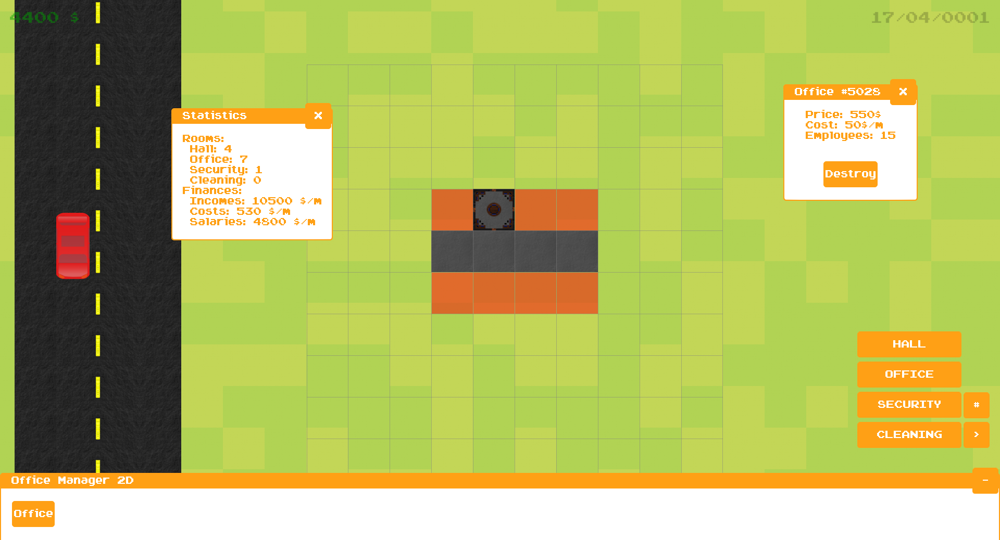

## Office Manager 2D version 1.0
Hello, there!

This is initial version of my project OM2D. Currently, supported
features:

1) Build 4 types of rooms in office.
2) View your office information
3) Monitor prices for your rooms
4) Time passes while playing: days, months and years 
5) 2 textures were recently added for 2 rooms

But this is not the end! I'm actively developing my project to make it very funny!

Here you can view the screenshot from current version:

